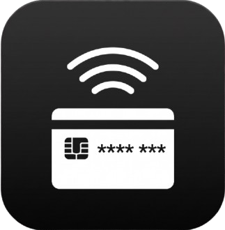

<div align="center">
  
  <h1>E-Money Checker</h1>
  <p>Buka app → Tempel kartu → Saldo muncul. Selesai.</p>

  
  
  
  
  
</div>

---

Aplikasi Android ringan untuk baca saldo kartu e-money via NFC — offline sepenuhnya, tanpa login, tanpa iklan, tanpa data yang perlu khawatir bocor. Dirancang untuk satu tujuan: kecepatan.

## Kartu yang Didukung

| Kartu | Bank | Standar |
|-------|------|---------|
| **e-Money** | Mandiri | ISO/IEC 14443-4 |
| **Flazz Gen 2** | BCA | ISO/IEC 14443-4 (Java Card) |
| **TapCash** | BNI | ISO/IEC 14443-4 |
| **Brizzi** | BRI | ISO/IEC 14443-4 |

> [!NOTE]
> BCA Flazz **Gen 1** (chip Mifare Classic) tidak didukung karena menggunakan enkripsi Crypto-1 proprietary yang tidak bisa diakses via NFC standar Android.

## Cara Kerja

```
Buka app  →  Tempel kartu di belakang HP  →  Saldo tampil < 300ms
```

Tidak ada tombol "Scan". Tidak ada halaman login. Tidak ada spinner loading 5 detik. App langsung masuk mode baca begitu dibuka — kartu ditempel, saldo keluar.

## Fitur

- **Baca saldo instan** — dari kartu terdeteksi hingga angka muncul di layar ≤ 350ms
- **Auto-deteksi bank** — tidak perlu pilih kartu manual, langsung tahu Mandiri/BCA/BNI/BRI
- **Nomor kartu ter-masking** — hanya tampil `6032 •••• •••• 1234`, tidak pernah penuh
- **Haptic feedback** — getaran berbeda untuk deteksi, sukses, dan error — terasa seperti alat ukur fisik
- **Salin saldo ke clipboard** — satu ketuk, langsung tersalin
- **NFC disabled handler** — ada shortcut langsung ke pengaturan NFC jika sensor mati
- **Zero storage** — saldo hanya ada di memory selama app buka, tidak pernah disimpan ke disk

## Privacy & Keamanan

App ini tidak bisa mengakses internet — secara teknis, bukan hanya kebijakan.

- `AndroidManifest.xml` tidak mengandung permission `INTERNET` sama sekali
- Tidak ada Room, SharedPreferences, atau file storage apapun
- Nomor kartu selalu diobfuskasi sebelum ditampilkan
- Tidak ada analytics, tidak ada crash reporting ke server eksternal

## Stack Teknis

| Komponen | Teknologi |
|----------|-----------|
| Language | Kotlin 1.9+ |
| UI | Jetpack Compose + Material3 |
| Architecture | Clean Architecture + MVI |
| DI | Koin |
| Concurrency | Coroutines + StateFlow |
| NFC API | `NfcAdapter.enableReaderMode` |
| Min SDK | 26 (Android 8.0 Oreo) |

### Kenapa `enableReaderMode`, bukan `enableForegroundDispatch`?

`enableForegroundDispatch` adalah API lama yang memicu bunyi NFC default Android dan menambah ~120ms latency karena OS perlu probe NDEF tag dulu. `enableReaderMode` dengan flag `FLAG_READER_SKIP_NDEF_CHECK` melewati probe ini — hasilnya lebih cepat dan tidak ada bunyi sistem yang bentrok.

## Arsitektur Module

```
:app            → Entry point, DI wiring, NFC lifecycle (MainActivity)
:presentation   → Compose UI + ViewModel
:nfc-engine     → APDU I/O, card parser per bank, IsoDep wrapper
:domain         → Pure Kotlin: model, interfaces, use cases (zero Android dependency)
```

Dependency hanya mengalir ke dalam — `:domain` tidak tahu Android exist. `:presentation` tidak tahu implementasi NFC konkret. `:app` adalah satu-satunya titik yang mengikat semuanya.

## Mulai Development

**Prasyarat:**
- Android Studio Hedgehog atau lebih baru
- JDK 17
- Device fisik ber-NFC (emulator tidak bisa test NFC)

```bash
git clone https://github.com/your-username/emoney-checker.git
cd emoney-checker
./gradlew assembleDebug
```

Install ke device:

```bash
adb install app/build/outputs/apk/debug/app-debug.apk
```

### Build Release

```bash
./gradlew assembleRelease
```

> [!IMPORTANT]
> Build release membutuhkan keystore. Buat file `keystore.properties` di root project sebelum build release.

## Testing

Unit test parser dan ViewModel tanpa hardware NFC menggunakan `FakeIsoDepWrapper` dan `FakeCardReader`.

```bash
# Unit tests
./gradlew test

# Lint (zero warning policy untuk exported components)
./gradlew lint

# Kotlin code style check
./gradlew ktlintCheck
```

## Performance Target

| Metrik | Target |
|--------|--------|
| Kartu terdeteksi → saldo tampil | ≤ 350ms |
| Cold start app | ≤ 600ms (mid-range device) |
| APK size (optimized) | ≤ 6.5 MB |
| Crash-free sessions | ≥ 99.8% |

## Roadmap

Phase 1 (MVP) yang sekarang mencakup baca saldo 4 kartu utama. Fitur berikut dipertimbangkan untuk phase selanjutnya, bergantung pada feasibility teknis dan regulasi:

- [ ] Riwayat mutasi transaksi per kartu
- [ ] Dukungan kartu tambahan (e-Toll, JakCard)
- [ ] Widget homescreen untuk cek saldo tanpa buka app
- [ ] Ekspor riwayat ke CSV

> [!NOTE]
> Fitur top-up saldo **tidak** akan diimplementasi — membutuhkan SAM hardware module dan lisensi PJP dari Bank Indonesia, di luar scope utilitas personal.

---

<div align="center">
  <sub>Dibuat untuk orang yang capek nunggu app bank loading cuma buat lihat tiga angka.</sub>
</div>
